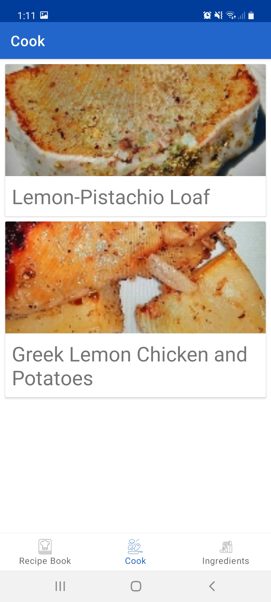
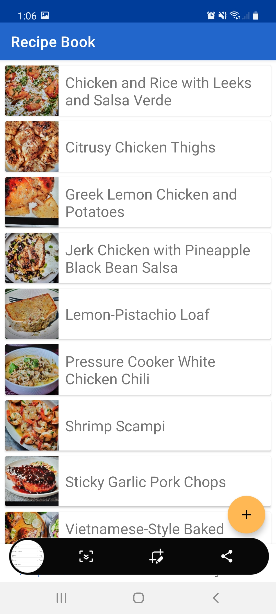
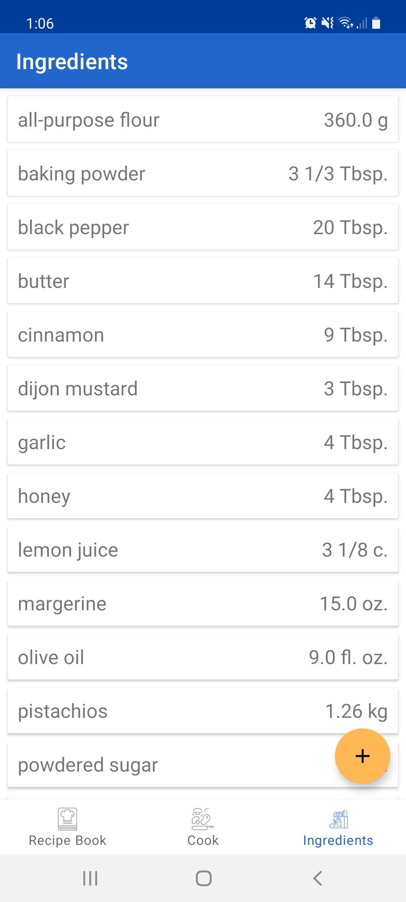
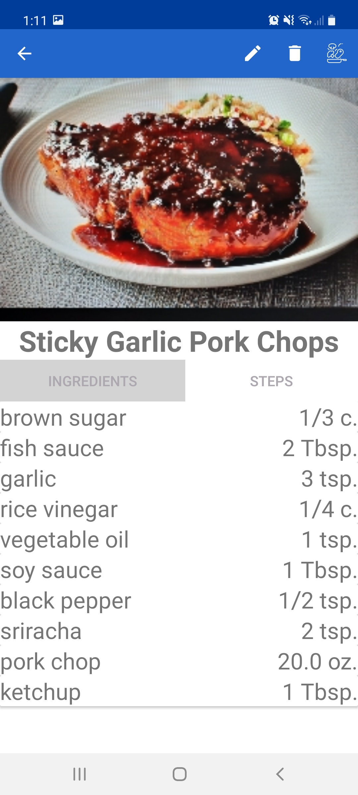

<h1>Kitchen Companion - Final Design Report</h1>
Table of Contents:

- [Project Description](#project-description)
- [User Interface Specification](#user-interface-specification)
- [Test Plan and Results](#test-plan-and-results)
- [User Manual](#user-manual)
- [Spring Presentation](#spring-presentation)
- [Expo Poster](#expo-poster)
- [Assessments](#assessments)
  - [Fall Assessment](#fall-assessment)
  - [Spring Assessment](#spring-assessment)
- [Summary of Hours](#summary-of-hours)

# Project Description
Choosing recipes to cook, specifically during a busy work week, can be hard and tiresome. Even if you have an idea of what you want to eat, you might find out that you are missing a key ingredient, making the process of choosing what to cook even more frustrating. 
Kitchen Companion is a mobile application that helps alleviate any stress when it comes to figuring out what to cook. It will allow users to keep track of what ingredients they have available and give them recipes to cook based on what they have. 
By using kitchen companion, users will spend less time trying to figure out what they can cook, and more time eating delicious meals.

Kitchen Companion is an Android application that allows users to keep track of what ingredients they have in their kitchen, save recipes to a recipe book, and get recipes from their recipe book based on the ingredients they have in their kitchen. This project aims to get more people into cooking at home by helping alleviate any stress that comes with deciding what to cook.

# User Interface Specification

      

Above are some screen captures from the application that give an idea on how the user interface is designed for this project. Navigation between the main activities is done from the Bottom Navigation bar as can be seen in the first three screenshots. Card views along with recycler views are used for the three main activities when generating the content of these activities. This includes recipe cards for the recipes screen, ingredient cards for the ingredients screen, and cookable recipes for the cook screen. These cards are fully swipeable (details of these actions can be read about in the user manual). Activities that go further into details from the three main activities, like the fourth screenshot which is viewing a recipe's details, utilitize the menu bar to hold actions that can be done. 

# Test Plan and Results

Link to Test Plan: [Test Plan](https://github.com/antonej12/kitchen-companion/blob/master/files/Senior%20Design%20Test%20Plan.pdf)

**Overall Test Plan**
The important aspects I wish to cover with this test plan is making sure the functionality
of all systems within the application are working as intended. This starts with making
sure the reading and writing of data for both the recipe system and integredient system
are working as they should be, allowing the user to make changes and see what is
being stored correctly. The aspects that combine these two systems will undergo
integration testing to make sure the interfaces between these two systems work
correctly. Additional testing will be conducted to make sure authentication and data
security are functional. User experience testing will also be conducted to get useful
feedback from potential users that will help make the application better. Finally, various
testing mechanisms offered by Google Firebase will be leveraged to retrieve additional
information regarding performance and usability among varying devices.

Test Results:

|Test Case|Execution Notes|Results|
|---|---|---|
|User Authentication Test 1|||
|User Authentication Test 2|||
|Recipe Storage System Test 1|||
|Recipe Storage System Test 2|||
|Ingredient Storage System Test 1|||
|Ingredient Storage System Test 2|||
|Data Security Test 1|||
|Recipe Retrieval Test 1|||
|Barcode Scanning System Test 1|||
|Unit Library Integrity Test 1|||
|Cooking Activity System Test 1|||
|User Experience Satisfaction Test 1|||
|Firebase Robo Test 1|||
|Firebase Performance Test 1|||

# User Manual

todo

# Spring Presentation
[Spring Presentation Slide Deck](https://docs.google.com/presentation/d/16lV30k5VJPebfR9sPBIMGZbJqEP6NsKh34qQlwuhY2E/edit?usp=sharing)

[Spring Presentation Video](https://www.youtube.com/watch?v=ZzVQTz4BEVE)

# Expo Poster
[Poster Link](Project_Assignments/posterFinal.pdf)

# Assessments

## Fall Assessment

For my senior design project, I will be creating a mobile application called "Kitchen Companion". This application is all about making cooking and the kitchen experience easier for its users. The main features that will make this happen are an inventory keeper of ingredients the user has available in their kitchen, and a recipe suggester that uses the ingredient inventory to let a user know what they can make based on what they have available. This application will give me the full experience of application development from start to finish, something I have learned a lot about during my academic and professional career. This project will also give me the opportunity to get some experience working in a mobile environment, which is something I haven't yet done. This project will be a great way for me to show everything I have learned during my time at the University of Cincinnati.

I have taken many courses during my time at UC that will be beneficial going forward with my senior design project. Classes like CS1021C(Computer Science I), CS2021(Python Programming), and EECE3093C(Software Engineering) have all given me experience with C++, Python, and Java programming languages respectively. The knowledge I have gained about each languages and the differences between them will be beneficial towards deciding what language is best suited for my project. EECE3093C(Software Engineering) has also given me a good understanding of looking at a project as a whole, and not just as individual files of code. I have gained a strong introduction to the world of databases through CS4092 (Database Design), which is going to be an important part of the inventory side of my application.

As for my co-op experience, I gained a lot of knowledge about software development and software engineering during my time as a software engineering co-op with KLH Engineers. I worked with my manager Michael Brun (Software Architect) and Cody Couch (Software Programmer) on the company's application focused on maximizing business process and engineering efficiencies, and gained a lot of experience on application programming. A lot of the work I did involved the hook up between the front-end and the back-end, and while doing so, had a lot of conversations about user interface with Tim Butcher (Lead Technology Designer) who was the go-to person for things about user interface. These experiences will be beneficial as I design and program my senior project, and I am confident that the things I have learned through my co-op experiences will make the process easier.

I am very excited to be pursuing the project that I am. When I took my first programming class in high school, I knew software and application development would be something I would love to make a career out of. As I began college, I was interested to see if any other subject mater within CS would become more interesting to me as I went through the curriculum and co-ops. As I reach my final year at UC, I have certainly gained experiences in other topic areas that I have enjoyed, but nothing has come close to the passion I have for software programming and development. This project will serve as a great medium for me to show how much I have learned this being here at UC and showcase where my passions within computer science lie.

One of the reasons I like my project idea a lot, is that it is an idea that has a lot of attainable goals along the way that I can use to measure my success. I can have a very baseline expectation that should be very attainable as a minimum viable product that will still be a significant effort, but yield a good project. My preliminary approach to designing this application would be an application that allows users to manually input their kitchen inventory, and match that inventory against user-inputted recipes to determine what the user can cook. I can then look at the application from a far more advanced view, and have the ability for a user to use their phone to scan product bar codes to take stock of their kitchen, and then automatically scrape recipes from across the web based on what is in their stock. The path between these two approaches yields many different milestones I can hit and use as a measure of success. The incremental nature of my project sets me up for a clear way to determine results and accomplishments.

## Spring Assessment

Obviously, by working alone, my individual contribution to the project was the entire thing. I was able to build on and apply the skills I had mentioned in my self-assessment from the Fall. These included things like programming knowledge gained through various classes I have taken at UC like CS1021C (Computer Science I) and CS2021 (Python Programming). This also includes knowledge about the software development process from courses like EECE3093C (Software Engineering). I also applied a lot of what I learned as a Software Engineering Co-op at KLH Engineers by doing application programming and user interface design and implementation. Overall, I was able to make good use of things I have learned during my time at UC and was also able to build upon those skills by working on this senior design project.

For my project, I created an Android application based around cooking recipes and keeping track of what ingredients users have on-hand. This required many of the skills mentioned in the paragraph above, but also many new things that I have yet to experience much of. These included mobile development, database design, using cloud resources, and more. I got up to speed with Android development by going through a lot of free tutorials and courses on the subject, and did similar things to learn about using cloud resources. I worked with Google Firebase to host the application, store my data, and authenticate users. Overall, I would call the project a success. I was able to create a functional Android application that does what it set out to do. I personally believe I had great successes designing my NoSQL database on Firebase, developing a unit library to make working with various units of measure simple, and making the application as usuable as possible given the time and resources available. The hardest challenges would generally come from my lack of familiarity with some of the fields I worked with, especially because a lot of these technologies are very new and bleeding edge. This would make finding reference material difficult and I would often realize that the reference material I did find was already out-of-date despite being only months old. Adding a barcode scanning feature to my app also proved to be very troublesome, as I quickly learned how unstandardized UPC codes are, but I believe I was able to make a good effort in implementing that feature to the best of my ability.

# Summary of Hours
